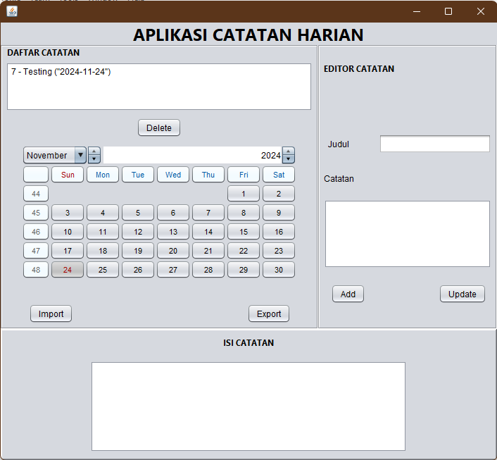

# MuhammadNurRizhanAshari-2210010295-UTS

 MuhammadNurRizhanAshari - 2210010295 -  UTS

# Aplikasi Catatan Harian

Aplikasi **Catatan Harian** adalah aplikasi berbasis Java yang memungkinkan pengguna untuk menyimpan, mengelola, mencari, mengimpor, dan mengekspor catatan harian. Aplikasi ini menggunakan GUI berbasis `Swing` dan mendukung ekspor/impor data dalam format CSV.

## Fitur

- **Tambah Catatan**: Menambahkan catatan baru dengan judul, isi, dan tanggal.
- **Edit Catatan**: Memperbarui catatan yang sudah ada.
- **Hapus Catatan**: Menghapus catatan yang dipilih.
- **Cari Catatan Berdasarkan Tanggal**: Mencari catatan menggunakan tanggal tertentu.
- **Ekspor ke CSV**: Mengekspor semua catatan ke file `catatan.csv`.
- **Impor dari CSV**: Mengimpor catatan dari file `catatan.csv`.

## Persyaratan Sistem

- **Java Development Kit (JDK)**: Versi 8 atau lebih baru.
- **Database**: Aplikasi ini menggunakan database relasional. Anda dapat menggunakan SQLite atau database lain yang kompatibel dengan JDBC.

## Instalasi

1. **Kloning Repository**:
    ```bash
    git clone https://github.com/username/aplikasi-catatan-harian.git
    cd aplikasi-catatan-harian
    ```

2. **Konfigurasi Database**:
   - Pastikan database tersedia.
   - Sesuaikan metode `connect()` di kode untuk menghubungkan ke database Anda.

3. **Komplikasi dan Jalankan Aplikasi**:
    - Kompilasi kode:
      ```bash
      javac -cp . AplikasiCatatanHarian.java
      ```
    - Jalankan aplikasi:
      ```bash
      java AplikasiCatatanHarian
      ```

## Penggunaan

1. **Menambahkan Catatan**:
   - Isi judul dan konten catatan.
   - Klik tombol `Tambah` untuk menyimpan catatan.

2. **Mengedit Catatan**:
   - Pilih catatan dari daftar.
   - Ubah judul atau konten.
   - Klik tombol `Perbarui`.

3. **Menghapus Catatan**:
   - Pilih catatan dari daftar.
   - Klik tombol `Hapus`.

4. **Mencari Berdasarkan Tanggal**:
   - Pilih tanggal menggunakan kalender.
   - Catatan yang sesuai akan muncul di daftar.

5. **Ekspor ke CSV**:
   - Klik tombol `Ekspor`.
   - File CSV akan disimpan dengan nama `catatan.csv`.

6. **Impor dari CSV**:
   - Klik tombol `Impor`.
   - Data dari file CSV akan ditambahkan ke database.

## Struktur Database

Tabel `notes` digunakan untuk menyimpan catatan dengan struktur sebagai berikut:

| Kolom   | Tipe Data    | Keterangan                     |
|---------|--------------|---------------------------------|
| `id`    | INTEGER      | Primary Key, Auto Increment    |
| `title` | VARCHAR(255) | Judul catatan                  |
| `content` | TEXT        | Isi catatan                   |
| `date`  | DATE         | Tanggal pembuatan/perbaruan    |

## Kontribusi

Kontribusi sangat diterima! Jika Anda menemukan bug atau memiliki ide untuk fitur baru, silakan buat _issue_ atau kirimkan _pull request_.

1. Fork repository ini.
2. Buat branch fitur baru:
    ```bash
    git checkout -b fitur-anda
    ```
3. Komit perubahan Anda:
    ```bash
    git commit -m "Menambahkan fitur baru"
    ```
4. Push ke branch Anda:
    ```bash
    git push origin fitur-anda
    ```
5. Buat _pull request_.

## Tampilan

---

Dibuat dengan ❤️ oleh [Muhammad Nur Rizhan Ashari](https://github.com/Bombollini)
